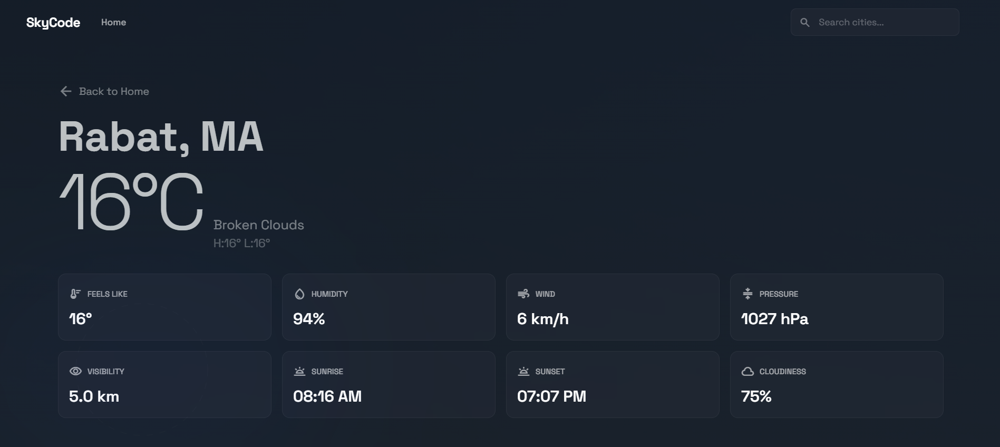

# SkyCode - Application Météo

Application de météo moderne et élégante construite avec React, Redux et Tailwind CSS.

## 📸 Capture d'écran



## 🌟 Fonctionnalités

- **Recherche de Ville** : Recherchez n'importe quelle ville dans le monde pour obtenir les conditions météorologiques actuelles.
- **Détails Complets** : Accédez à une vue détaillée comprenant la température ressentie, l'humidité, la vitesse du vent, la pression, la visibilité, et les heures de lever/coucher du soleil.
- **Favoris** : Ajoutez vos villes préférées à une liste de favoris pour un accès rapide.
- **Navigation Fluide** : Système de routage intuitif pour naviguer entre l'accueil et les détails des villes.
- **Design Moderne** : Interface utilisateur soignée avec un effet "Glassmorphism" et des animations dynamiques.

## 🛠️ Technologies Utilisées

- **[React](https://reactjs.org/)** : Bibliothèque JavaScript pour l'interface utilisateur.
- **[Redux Toolkit](https://redux-toolkit.js.org/)** : Gestion d'état globale de l'application.
- **[React Router](https://reactrouter.com/)** : Gestion de la navigation et des routes.
- **[Tailwind CSS](https://tailwindcss.com/)** : Framework CSS utilitaire pour le stylisme rapide et responsive.
- **[OpenWeatherMap API](https://openweathermap.org/api)** : Source de données météorologiques.
- **Axios** : Client HTTP pour les requêtes API.

## 🚀 Installation et Lancement

1.  **Cloner le projet**
    ```bash
    git clone https://github.com/Anasselghalbzouri/AnassMeteo.git
    cd meteo
    ```

2.  **Installer les dépendances**
    ```bash
    npm install
    ```

3.  **Lancer l'application**
    ```bash
    npm start
    ```

    L'application sera accessible à l'adresse [http://localhost:3000](http://localhost:3000).

## 📂 Structure du Projet

- `src/components` : Composants Réutilisables (Cartes météo, Navigation, etc.).
- `src/store` : Configuration Redux et Slices.
- `src/api` : Gestion des appels API.

Anass El Ghalbzouri.
